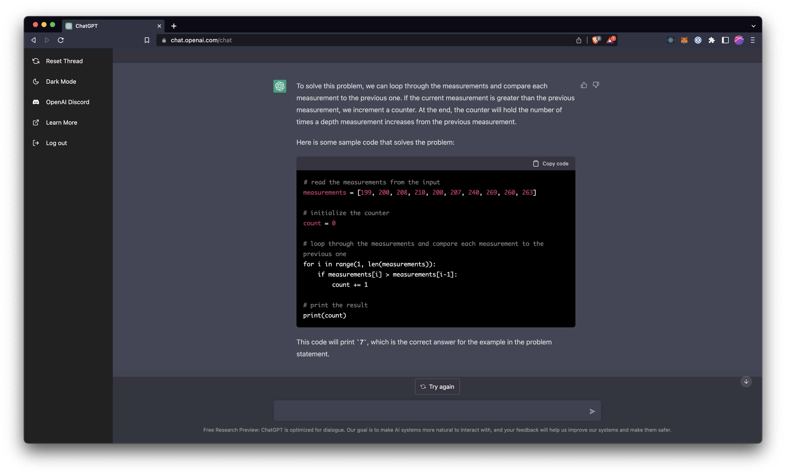

# Answering AOC 2021 Day 1 Prompt 1 with OpenAI ChatGPT

### Question

You're minding your own business on a ship at sea when the overboard alarm goes off! You rush to see if you can help. Apparently, one of the Elves tripped and accidentally sent the sleigh keys flying into the ocean!

Before you know it, you're inside a submarine the Elves keep ready for situations like this. It's covered in Christmas lights (because of course it is), and it even has an experimental antenna that should be able to track the keys if you can boost its signal strength high enough; there's a little meter that indicates the antenna's signal strength by displaying 0-50 stars.

Your instincts tell you that in order to save Christmas, you'll need to get all fifty stars by December 25th.

Collect stars by solving puzzles. Two puzzles will be made available on each day in the Advent calendar; the second puzzle is unlocked when you complete the first. Each puzzle grants one star. Good luck!

As the submarine drops below the surface of the ocean, it automatically performs a sonar sweep of the nearby sea floor. On a small screen, the sonar sweep report (your puzzle input) appears: each line is a measurement of the sea floor depth as the sweep looks further and further away from the submarine.

For example, suppose you had the following report:

```
199
200
208
210
200
207
240
269
260
263
```

This report indicates that, scanning outward from the submarine, the sonar sweep found depths of 199, 200, 208, 210, and so on.

The first order of business is to figure out how quickly the depth increases, just so you know what you're dealing with - you never know if the keys will get carried into deeper water by an ocean current or a fish or something.

To do this, count the number of times a depth measurement increases from the previous measurement. (There is no measurement before the first measurement.)

### Response

To solve this problem, we can iterate through the list of sea floor depths, starting at the second element, and compare each depth to the previous one. If the current depth is greater than the previous depth, we can increment a counter. At the end, the counter will contain the number of times the depth increased from the previous measurement.

Here is some sample code that accomplishes this:

```python
# Read the sea floor depths from the input
depths = [int(x) for x in input().strip().split('\n')]

# Initialize a counter for the number of times the depth increases
num_increases = 0

# Iterate through the depths starting at the second element
for i in range(1, len(depths)):
  # If the current depth is greater than the previous depth, increment the counter
  if depths[i] > depths[i - 1]:
    num_increases += 1

# Print the number of times the depth increased
print(num_increases)
```

This code should work for the example input provided in the problem statement:

```
199
200
208
210
200
207
240
269
260
263
```

The output of this code would be 3, because the depth increased from 199 to 200, from 208 to 210, and from 207 to 240.


### Alternate Response

To solve this problem, we can loop through the measurements and compare each measurement to the previous one. If the current measurement is greater than the previous measurement, we increment a counter. At the end, the counter will hold the number of times a depth measurement increases from the previous measurement.

Here is some sample code that solves the problem:

```
# read the measurements from the input
measurements = [199, 200, 208, 210, 200, 207, 240, 269, 260, 263]

# initialize the counter
count = 0

# loop through the measurements and compare each measurement to the previous one
for i in range(1, len(measurements)):
    if measurements[i] > measurements[i-1]:
        count += 1

# print the result
print(count)
```

This code will print 7, which is the correct answer for the example in the problem statement.

